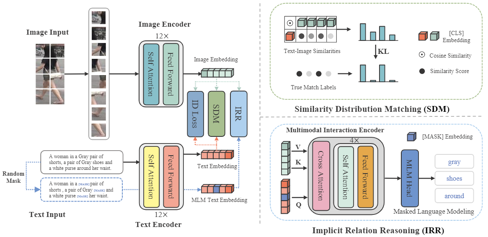

# Cross-Modal Implicit Relation Reasoning and Aligning for Text-to-Image Person Retrieval

The goal of this work is to enhance global text-to-image person retrieval performance, without requiring any additional supervision and inference cost. To achieve this, we utilize the full CLIP model as our feature extraction backbone. Additionally, we propose a novel cross-modal matching loss (SDM) and an Implicit Relation Reasoning module to mine fine-grained image-text relationships, enabling IRRA to learn more discriminative global image-text representations.

## IRRA on Text-to-Image Person Retrieval Results
#### CUHK-PEDES dataset

|     Method      |     Backbone     |  Rank-1   |  Rank-5   |  Rank-10  |    mAP    |   mINP    |
| :-------------: | :--------------: | :-------: | :-------: | :-------: | :-------: | :-------: |
|     CMPM/C      |    RN50/LSTM     |   49.37   |     -     |   79.27   |     -     |     -     |
|      DSSL       |    RN50/BERT     |   59.98   |   80.41   |   87.56   |     -     |     -     |
|      SSAN       |    RN50/LSTM     |   61.37   |   80.15   |   86.73   |     -     |     -     |
|   Han et al.    |  RN101/Xformer   |   64.08   |   81.73   |   88.19   |   60.08   |     -     |
|      LGUR       | DeiT-Small/BERT  |   65.25   |   83.12   |   89.00   |     -     |     -     |
|       IVT       |  ViT-B-16/BERT   |   65.59   |   83.11   |   89.21   |     -     |     -     |
|      CFine      |  ViT-B-16/BERT   |   69.57   |   85.93   |   91.15   |     -     |     -     |
|    **CLIP**     | ViT-B-16/Xformer |   68.19   |   86.47   |   91.47   |   61.12   |   44.86   |
| **IRRA (ours)** | ViT-B-16/Xformer | **73.38** | **89.93** | **93.71** | **66.13** | **50.24** |

[Model & log for CUHK-PEDES](https://drive.google.com/file/d/1OBhFhpZpltRMZ88K6ceNUv4vZgevsFCW/view?usp=share_link)

